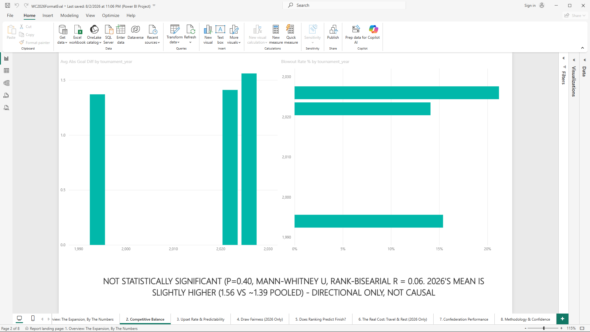
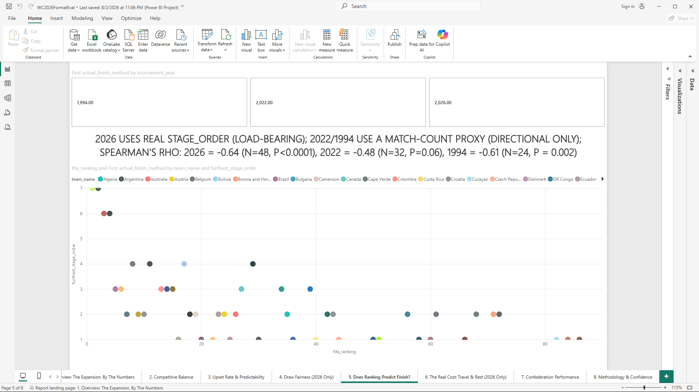
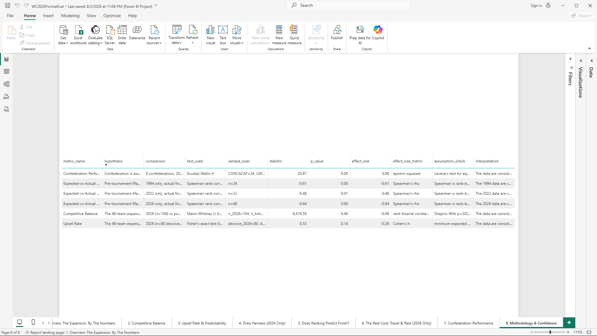

# WC2026 Format Evaluation

A Snowflake data pipeline and Power BI dashboard evaluating whether FIFA's
expansion of the World Cup to 48 teams increased global representation
without materially degrading competitive balance or scheduling fairness
relative to prior tournament formats.

---

## Overview

FIFA expanded the men's World Cup from 32 to 48 teams starting in 2026.
This project builds an end-to-end analytics pipeline (raw ingestion,
automated data-quality validation, a dimensional model, and five
statistically validated analytical marts) to test that expansion against
104 matches from the 2026 tournament and 116 matches from two prior
formats: 2022's 32-team World Cup and 1994's 24-team World Cup, all under
the same metric definitions.

Who this is for: a FIFA tournament strategy analyst or format-planning
stakeholder deciding whether the 48-team structure should be retained,
adjusted, or reconsidered. As a portfolio piece, it's also for anyone
evaluating whether I can take a real analytical question through
sourcing, modeling, statistical testing, and presentation without
skipping steps.

Final output: five Snowflake `ANALYTICS` marts (competitive balance,
group difficulty, upset rate, confederation performance,
expected-vs-actual), each backed by a hypothesis test with an effect
size, never a bare p-value or a causal claim. An 8-page Power BI report
sits on top, built on eight governed secure views, with a full
sourcing/decision trail for every input used.

---

## Why I Built This

I built this as a portfolio piece to demonstrate an end-to-end Snowflake
analytics pipeline (ingestion through validation, dimensional modeling,
analytics, and BI presentation) on a real, falsifiable question rather
than a toy dataset. It also gave me a hands-on way to learn Snowflake
itself: schema design, Streams and Tasks for incremental loads, Secure
Data Shares for cross-account governance, native geospatial functions.
I applied all of it to a question I could sanity-check against something
I already understood: football.

---

## Key Features

- Built a fully idempotent, six-schema Snowflake pipeline (`RAW` →
  `VALIDATION` → `CORE` → `ANALYTICS` → `SHARED`, plus `AUDIT`). Every
  load and rebuild script is safe to re-run, verified by actually
  re-running each one, not assumed.
- Independently sourced and then cross-checked every non-match-result
  input against a second, unrelated source: FIFA rankings, the group
  draw, venue coordinates, and the confederation crosswalk. Zero
  disagreements found across every data point checked.
- Ran five hypothesis tests (Mann-Whitney U, Fisher's exact, Kruskal-Wallis,
  Spearman rank correlation) comparing the 48-team 2026 format against
  pooled 2022/1994 data, each reporting an effect size and a plain-language
  practical-significance read, never just a p-value.
- Built and proved an incremental-load pipeline (Snowflake Streams and
  Tasks) that produces results identical to a full rebuild, verified by
  content-hash comparison across three real scenarios: new match, score
  correction, idempotent no-op rerun.
- Demonstrated real producer/consumer data governance with a Secure Data
  Share to a second Snowflake account, then verified, by actually trying
  the query rather than assuming, that the consumer account cannot see
  `RAW`.
- Authored an 8-page Power BI report (`.pbip`, git-diffable) reading only
  from eight governed secure views, with zero direct access to raw or
  intermediate schemas.

---

## Tech Stack

- Python 3.14
- Snowflake (SQL, Streams, Tasks, Secure Data Shares, native geospatial
  functions)
- `snowflake-connector-python`, `python-dotenv`, `scipy`, `pytest`,
  `requests`
- Power BI Desktop (`.pbip` project format: semantic model plus report,
  authored via the `powerbi-modeling-mcp` TOM API and Desktop for visual
  authoring)
- Git / GitHub (issue- and PR-driven workflow)

---

## Project Workflow

1. Feasibility research and source validation: inventory every candidate
   data source, tier its reliability, reject what can't be independently
   verified
2. Problem statement lock and schema design: decide the falsifiable
   question and the dimensional shape before touching Snowflake
3. Raw ingestion: land every source file into Snowflake's `RAW` schema
   unmodified, with load auditing
4. Data-quality validation: automated, re-runnable checks; nothing fails
   silently, nothing gets dropped without a record
5. Dimensional modeling: build `CORE`'s star schema, verify zero orphaned
   foreign keys
6. Historical comparison: extend the same fact table to 2022 and 1994 so
   2026 has something to be measured against, under identical metric
   definitions
7. Geospatial / travel-rest analysis: venue-to-venue distance and rest
   days per team, using Snowflake's native `ST_DISTANCE`
8. Rankings resolution, analytical marts, and statistical validation:
   close the FIFA ranking gap, then build and statistically test all five
   marts
9. Incremental pipeline demonstration: prove new data can be applied
   without a full rebuild
10. Cross-account sharing: govern access to the marts via Secure Data
    Share, verified from the consumer side
11. Power BI presentation layer: turn the marts into an 8-page report
12. Consolidation: cost report, limitations doc, this README, tagged
    `v1.0`

Full build-by-build detail and every sourcing/design decision (including
what was rejected and why): `docs/decision_log.md`.

---

## Data Sources

- Match results (2026, plus 2022/1994 for historical comparison):
  `martj42/international_results`, CC0-licensed.
- Stage/group draw: Yahoo Sports editorial coverage, cross-checked
  against Wikipedia's 12 per-group articles. 48/48 teams agree exactly.
- Team-to-confederation crosswalk: compiled from known qualifying
  outcomes (no source existed to scrape), cross-checked against
  Wikipedia's six per-confederation membership pages. 62/62 teams agree
  exactly.
- Venue coordinates: sourced and cited per venue from Wikipedia,
  replacing an unlicensed, partially-fabricated third-party dataset ruled
  out during feasibility research. Cross-checked against
  OpenStreetMap/Nominatim; all 16 agree within 2.7-80.2 m.
- FIFA World Ranking: one snapshot per tournament, sourced from each
  tournament's own Wikipedia seeding article citing FIFA's official
  release, cross-checked against `en.fifaranking.net` by exact historical
  date. All 95 non-`NULL` values agreed exactly, and the second source
  backfilled 9 values the original source had omitted.

Every one of these is a real, licensed, cited input. There's no
synthetic or fabricated data anywhere in the pipeline. Full sourcing
rationale, including sources evaluated and rejected, is in
`docs/decision_log.md`. Known limitations of every source (single-
tournament snapshots, no live refresh mechanism) are in
`docs/limitations.md`.

---

## Results / Outcomes

All figures below are reproduced in `docs/statistical_validation_results.md`,
generated by `src/analytics/run_statistical_validation.py` against the
live Snowflake account, not hand-computed.

- 220 matches modeled across three tournaments (2026: 104, 2022: 64,
  1994: 52), joined to a common dimensional model.
- Competitive balance is not statistically significant (Mann-Whitney U,
  p=0.397, rank-biserial r=-0.06). 2026's own mean absolute goal
  difference is numerically higher than pooled 2022+1994 (1.56 vs. ~1.39).
  If the difference were real, it would point toward *less* balanced
  matches under expansion, not more.
- Upset rate is not statistically significant (Fisher's exact, p=0.136,
  Cohen's h=-0.26). 2026's upset rate (16.2%) is numerically lower than
  pooled 2022+1994 (26.7%).
- Confederation performance is statistically significant with a medium
  effect (Kruskal-Wallis, p=0.0009, epsilon-squared=0.079). Confederation
  membership is associated with real variation in per-match goal
  differential in 2026.
- Ranking-vs-finish correlation is statistically significant with a large
  effect in all three tournaments (Spearman's rho -0.61 to -0.64).
  Pre-tournament FIFA ranking is consistently associated with how far a
  team advances.
- Sourcing integrity: 100% agreement across every independently
  cross-checked data point (95 ranking values, 48 group-draw teams, 16
  venue coordinates, 62 confederation assignments) against a second,
  unrelated source.
- Pipeline integrity: incremental load proven identical to a full rebuild
  by content hash across all 3 tested scenarios (new-match arrival, a
  correction, an idempotent rerun). Every idempotency-sensitive script
  (`load_raw.py`, `build_core.py`, `build_travel_rest.py`) verified safe
  to re-run by actually re-running it.
- Cost: the entire pipeline, across all 10 builds, consumed 1.61
  Snowflake credits total (`docs/cost_report.md`), well under 1% of the
  starting trial balance.

None of the above is a causal claim. Every statistical result uses
"associated with" / "consistent with" language deliberately, per
`docs/problem_statement.md`'s methodology rule.

---

## Screenshots / Demo

No dashboard screenshots or demo video are committed to this repository
yet. The 8-page Power BI report exists locally as a `.pbip` project
(`powerbi/WC2026FormatEval.pbip`, tracked; the compiled `.pbix` binary is
not). A demo script and recording are planned as a separate, standalone
artifact outside this repo. Until screenshots are captured and committed,
the report is reproducible by opening the `.pbip` project in Power BI
Desktop against a live Snowflake account (see How to Run below), not yet
verifiable from static images.

**Demo video**: `[link pending, not yet recorded]`

**Screenshots**:

```markdown



```

Placeholders only, images not yet captured. These three pages carry the
most evidentiary weight on their own; once the demo video exists, stills
pulled from it will replace this block.

---

## How to Run

**Prerequisites**: Python 3 (developed against 3.14), a Snowflake
account.

```bash
python -m venv venv
venv\Scripts\activate        # Windows
pip install -r requirements.txt
```

Create a `.env` file in the repo root (never committed) with:

```text
SNOWFLAKE_ACCOUNT=
SNOWFLAKE_USER=
SNOWFLAKE_PASSWORD=
SNOWFLAKE_ROLE=
SNOWFLAKE_WAREHOUSE=
SNOWFLAKE_DATABASE=
SNOWFLAKE_SCHEMA=
```

`config.py` reads these via `python-dotenv`; every script in `src/`
imports from `config.py` rather than hardcoding credentials or paths.

Cross-account sharing (Build 9) needs a second, independent Snowflake
account. Add these to the same `.env`:

```text
SNOWFLAKE_SECONDARY_ACCOUNT=
SNOWFLAKE_SECONDARY_USER=
SNOWFLAKE_SECONDARY_PASSWORD=
SNOWFLAKE_SECONDARY_ROLE=
SNOWFLAKE_SECONDARY_WAREHOUSE=
SNOWFLAKE_SECONDARY_DATABASE=
SNOWFLAKE_SECONDARY_SCHEMA=
```

Run from the repo root, in order. Each step is idempotent, safe to
re-run:

```bash
python -m src.ingestion.fetch_historical_results  # fetch the full historical results dataset (not committed)
python -m src.ingestion.setup_snowflake   # create schemas, tables, warehouse config
python -m src.ingestion.load_raw          # load all RAW source files
python -m src.core.build_core             # populate CORE dimensions + fact_match
python -m src.geospatial.build_travel_rest  # populate the travel/rest mart
python -m src.analytics.run_statistical_validation  # run hypothesis tests, populate ANALYTICS.STATISTICAL_VALIDATION
python -m src.incremental.demo_incremental_load  # prove incremental load matches full rebuild
python -m src.sharing.setup_share         # share WC2026_SHARE with the secondary account (needs SNOWFLAKE_SECONDARY_* vars)
python -m src.sharing.verify_consumer_access  # accept the share, run a BI-shaped query, confirm RAW is inaccessible
python -m src.validation.run_checks       # run data-quality checks
python -m src.validation.reconcile_counts # source-to-warehouse row count reconciliation
```

Run the test suite:

```bash
pytest tests/ -v
```

For the Power BI report: open `powerbi/WC2026FormatEval.pbip` in Power BI
Desktop with the "Power BI Project (.pbip)" preview feature enabled, then
set the real Snowflake account identifier via Power Query's Manage
Parameters before refreshing. The committed project only has a
placeholder; the account locator is never hardcoded.

---

## Repository Structure

```text
config.py               Snowflake connection config + source file paths (env-driven)
data/
  raw/                   Source files, as pulled or independently compiled/cited
  processed/             Derived, reproducible outputs (e.g. the validated stage mapping)
docs/                    Problem statement, architecture, decision log, data dictionary,
                         metric definitions, statistical validation results, cost report,
                         limitations
sql/
  raw/                    RAW schema + table DDL, numbered for run order
  validation/             VALIDATION schema DDL + per-check detection queries
  core/                   CORE schema DDL + populate/ queries (dims, fact_match)
  analytics/               ANALYTICS schema DDL + populate/ queries (marts)
  shared/                  SHARED schema DDL: secure views + the share's grants
  audit/                    AUDIT schema DDL
src/
  ingestion/               Snowflake connection (primary + secondary), schema setup, RAW loading
  validation/               Data-quality checks (Python + orchestration)
  core/                     CORE dimensional model population
  geospatial/                Travel/rest mart population
  analytics/                 Statistical validation layer (5 marts are plain SQL views)
  incremental/                Incremental-load demo (Stream + stored procedure + Task)
  sharing/                    Cross-account share setup + consumer-side verification
  transform/                 Local, Snowflake-independent match/stage transform
tests/                    pytest suite + fixtures (including a deliberately bad-row fixture)
powerbi/                 .pbip project: semantic model (TMDL) + 8-page report (PBIR)
```

---

## What I Learned

- Found and fixed a non-idempotent `COPY INTO ... FORCE=TRUE` pattern that
  silently doubled row counts on re-run, by adding a truncate-first step.
  The project's own validation layer caught this on its first live run,
  not after the fact.
- Found and fixed a duplicate-venue bug: Arlington and Dallas were the
  same physical stadium, temporarily rebranded for one match. Caught
  before it could propagate into the geospatial travel-distance mart.
- Learned a real Snowflake quirk the hard way: `GENERATOR`/`SEQ4()`
  cross-joins can silently truncate a generated date dimension if not
  handled carefully.
- Learned Snowflake rejects bulk (`ALL`/`FUTURE`) grants of views to a
  Secure Data Share outright. Each shared view has to be granted
  individually, which has to be documented so a future added view isn't
  silently unshared.
- Practiced writing every sourcing and design decision down as it
  happened, including sources evaluated and rejected, not just the ones
  used. `docs/decision_log.md` is the result.

---

## Future Improvements

- Capture and commit real dashboard screenshots (and a demo video) so the
  Power BI report is verifiable without opening Power BI Desktop.
- Schedule `CORE.INCREMENTAL_FACT_MATCH_TASK` on a live cadence instead of
  leaving it created-but-suspended (currently a deliberate cost decision).
- Add kickoff-time-of-day data if a source is ever found, to make
  `rest_days` time-zone aware instead of date-only.
- Automate the second-source cross-check step so a future tournament
  cycle doesn't require re-sourcing every reference table by hand.
- Backfill `went_to_et`/`neutral_site` if a source with a separate
  regulation-time field is found.

---

## Contact

**Sanjay Dilip**
LinkedIn: [linkedin.com/in/sanjaydilip](https://linkedin.com/in/sanjaydilip)
GitHub: [sanjay-dilip](https://github.com/sanjay-dilip)
Email: sanjay.dilip3012@gmail.com
